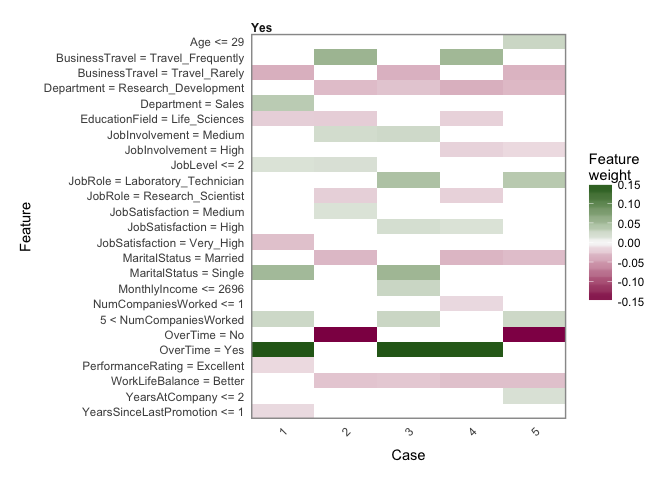

# Model interpretability 

Interpretability is becoming more and more important. While areas like finance and medicine are required to disclose how models come to conclusions, other sectors have had less incentive to do so. Nonetheless interpretability is a desirable feature by default[1](#ma_sun), [2](#zhou_etal).

## Interpretability options
Some models come with interpretability built in (such as tree based models), others are considered "black boxes". For these we can conduct post-hoc analysis to identify why they came to that conclusion. The following will discuss [LIME](#local-interpretable-model-agnostic-explanations-lime) and [SHAP](#shapley-additive-explanations-shap).

### Local Interpretable Model-Agnostic Explanations (LIME)

LIME offers a model-agnostic approach to explain any machine learning model. It works by approximating the model for individual cases.
See also their [github](https://github.com/marcotcr/lime) repository.

### SHapley Additive exPlanations (SHAP)

SHAP uses the game theoretic approach to explain models and can similarly be used for any machine learning model.
See also their [github](https://github.com/shap/shap) repository.

### Special considerations
Other implementations of LIME exist that may make better use of it. For example [caret](https://uc-r.github.io/lime) does a nice job of providing a simple way to create a heatmap of variable contribution to the individual cases.

1: <a href="https://www.sciencedirect.com/science/article/pii/S0167811620300410?via%3Dihub">Link </a>

2: <a href="https://journals.sagepub.com/doi/10.1177/00222437211042013">Link </a>

#### Additional resources
There are several online examples that go into model interpretability. [1](https://svitla.com/blog/interpreting-machine-learning-models-lime-and-shap), [2](https://towardsdatascience.com/three-interpretability-methods-to-consider-when-developing-your-machine-learning-model-5bf368b47fac)